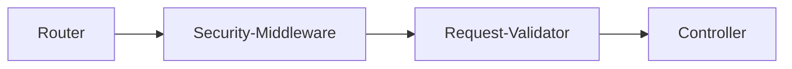

---
---

# Usage

In the previous section, you have learned how to generate the server stubs. The following is the file tree result if you are generating the server stubs of the [slightly adjusted Pet Store OpenAPI Specification 3.0](https://github.com/imballinst/oas-typescript/blob/main/packages/shared/src/openapi/api.json).

```
generated
├── controllers
│   ├── PetController.ts
│   ├── StoreController.ts
│   └── UserController.ts
├── static
│   ├── checksum.json
│   ├── client.ts
│   ├── controller-types
│   │   ├── PetControllerTypes.ts
│   │   ├── StoreControllerTypes.ts
│   │   └── UserControllerTypes.ts
│   ├── security-schemes.ts
│   ├── router.ts
│   ├── types.ts
│   └── utils.ts
└── middleware-helpers.ts
```

Before we dive deeper into each parts, here is the general flow on how a request is processed using the server stubs.



The amazing thing about `@oas-typescript` server stubs is that, you don't need to worry about most of the parts above. You only need to worry about "Security Middleware (optional)" and "Controller". The rest will be handled by the generated server stubs.

## Router

:::note
This is part of the server stubs, so you don't have to do anything here.
:::

First things first, router will receive request from the client. These routers are generated from the `paths` object in the OpenAPI Specification. These routers will gather up information from the request and then pass it to the security middleware, depending on whether `security` field or the field that you specified in `--app-security-requirements-field` exist or not in the operation object.

## Security Middleware (optional)

:::info
The security middleware is optional, because it's only required if there are endpoints with security requirements.
:::

The default security middleware looks like this.

<!--SNIPSTART middleware-helpers-vanilla-->

```ts
export class MiddlewareHelpers {
  static async doAdditionalSecurityValidation(
    headers: IncomingHttpHeaders,
    securityObject: SecuritySchemes
  ): Promise<void> {
    return Promise.resolve();
  }
}
```

<!--SNIPEND-->

The function receives `headers` and `securityObject`, the former comes from request whereas the latter comes from the OpenAPI specification. The function returns a resolved Promise (if validation is successful) and a rejected Promise (if validation fails). A modified security middleware helper looks like this:

<!--SNIPSTART middleware-helpers {"highlightedLines": "6-26"}-->

```ts {6-26}
export class MiddlewareHelpers {
  static async doAdditionalSecurityValidation(
    headers: IncomingHttpHeaders,
    securityObject: SecuritySchemes
  ): Promise<void> {
    let isValid = true;

    if (securityObject.api_key) {
      const apiKeyInHeader = headers[securityObject.api_key.meta.name];

      if (!apiKeyInHeader) {
        isValid = false;
      } else {
        // Example.
        isValid = apiKeyInHeader === 'helloworld';
      }
    }

    if (!isValid) {
      return Promise.reject(
        new SecurityMiddlewareError({
          status: 401,
          body: { message: 'invalid credentials' }
        })
      );
    }

    return Promise.resolve();
  }
}
```

<!--SNIPEND-->

If we look above, the added parts are related to validating the request. With the `securityObject` being type-safe, we can check if a request contains any available values defined in the top-level `components.securitySchemes` (or any field that's defined in your `--app-security-schemes-field`).

## Request validator

:::note
This is part of the server stubs, so you don't have to do anything here.
:::

Inside request validator, the following will be validated:

- From `parameters` in operation object: path parameters, query parameters, cookie, headers.
- From `requestBody` in operation object: request body

If any of them are specified as `required` in the specification but is missing from the request, then it will return `400 Bad Request`.

## Controller

Now, to the last one, controller. Inside controller, the data is already considered "sanitized", which means, all of the variables are already type-safe. Here, you will want to return an object consisting of at least `status`. The base controller looks like this.

```ts
export class PetController {
  static addPet: AddPetControllerFunction = (params) => {
    return {
      body: undefined,
      status: undefined
    };
  };
}
```

So here, we have a `PetController`, which is named after `<tag>Controller`. So, if you have a tag named "User", then it will be `UserController`. Inside this, you will want to do the endpoint operations. Using the `addPet` above, we can have a very simplified example.

```ts
const db: Pet[] = [];

export class PetController {
  static addPet: AddPetControllerFunction = (params) => {
    const existingPet = db.find((row) => row.name === params.body.name);
    if (existingPet) {
      return {
        status: 405,
        body: {}
      };
    }

    db.push(params.body);

    return {
      body: params.body,
      status: 200
    };
  };
}
```

So, what we're doing here is that, we specify an in-memory database for a list of pets. Then, when someone wants to add a pet, we check first in the database if there's a pet with an existing pet or not. If it exists, then return a response with status `405` and an error object. In the OpenAPI specification used, all fields of the error objects are optional, so we can pass an empty object instead.

There's that! With `@oas-typescript` server stubs, you will cut a lot of time implementing a server. Given an OpenAPI 3.0 Specification, all you need are only implementing the security middleware, controllers, and a simplified entry server. On top of that, by going design-first, we also prevent specification and actual server response mismatch.
